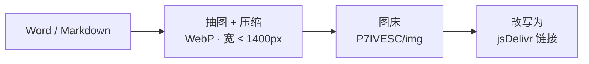
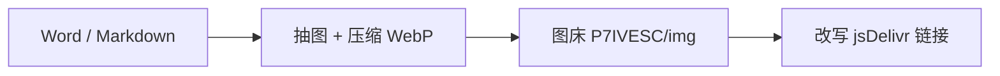
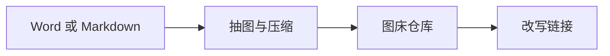

# mermaid 渲染测试（临时文件，稍后删除）

## 1 带 br 和引号

```mermaid
flowchart LR
  A["Word / Markdown"] --> B["抽图 + 压缩<br/>WebP · 宽 ≤ 1400px"]
  B --> C["图床<br/>P7IVESC/img"]
  C --> D["改写为<br/>jsDelivr 链接"]
```

## 2 只有引号，无 br

```mermaid
flowchart LR
  A["Word / Markdown"] --> B["抽图 + 压缩 WebP"]
  B --> C["图床 P7IVESC/img"]
  C --> D["改写 jsDelivr 链接"]
```

## 3 纯中文方括号

```mermaid
flowchart LR
  A[Word 或 Markdown] --> B[抽图与压缩]
  B --> C[图床仓库]
  C --> D[改写链接]
```
