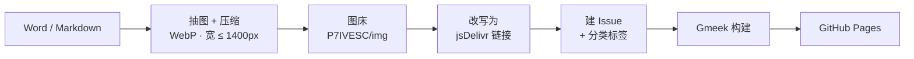
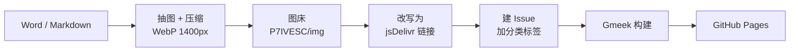
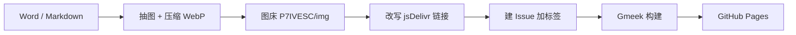
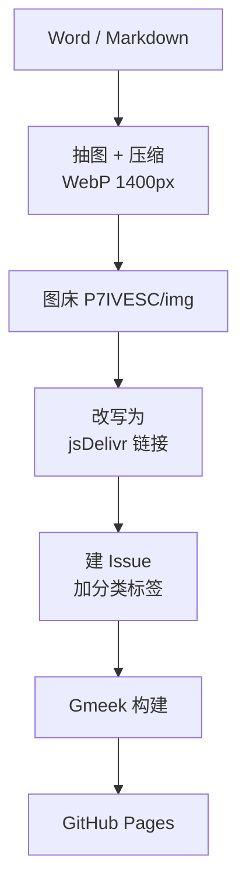

# mermaid 2

## V1 原样 7 节点

```mermaid
flowchart LR
  A["Word / Markdown"] --> B["抽图 + 压缩<br/>WebP · 宽 ≤ 1400px"]
  B --> C["图床<br/>P7IVESC/img"]
  C --> D["改写为<br/>jsDelivr 链接"]
  D --> E["建 Issue<br/>+ 分类标签"]
  E --> F["Gmeek 构建"]
  F --> G["GitHub Pages"]
```

## V2 去掉特殊符号

```mermaid
flowchart LR
  A["Word / Markdown"] --> B["抽图 + 压缩<br/>WebP 1400px"]
  B --> C["图床<br/>P7IVESC/img"]
  C --> D["改写为<br/>jsDelivr 链接"]
  D --> E["建 Issue<br/>加分类标签"]
  E --> F["Gmeek 构建"]
  F --> G["GitHub Pages"]
```

## V3 不用 br

```mermaid
flowchart LR
  A["Word / Markdown"] --> B["抽图 + 压缩 WebP"]
  B --> C["图床 P7IVESC/img"]
  C --> D["改写 jsDelivr 链接"]
  D --> E["建 Issue 加标签"]
  E --> F["Gmeek 构建"]
  F --> G["GitHub Pages"]
```

## V4 竖向

```mermaid
flowchart TB
  A["Word / Markdown"] --> B["抽图 + 压缩<br/>WebP 1400px"]
  B --> C["图床 P7IVESC/img"]
  C --> D["改写为<br/>jsDelivr 链接"]
  D --> E["建 Issue<br/>加分类标签"]
  E --> F["Gmeek 构建"]
  F --> G["GitHub Pages"]
```
